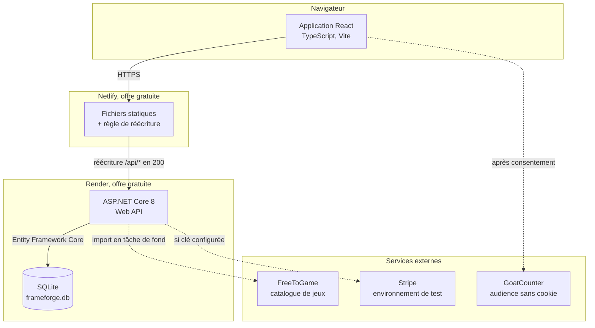
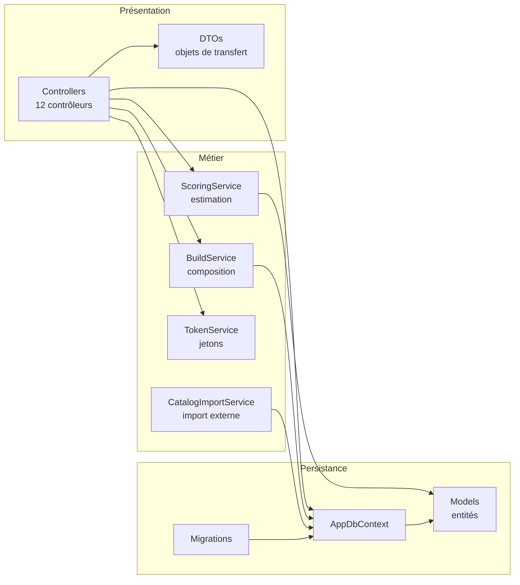
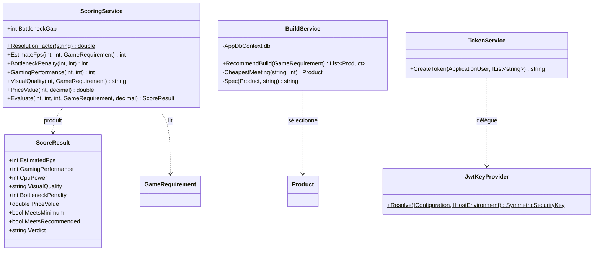
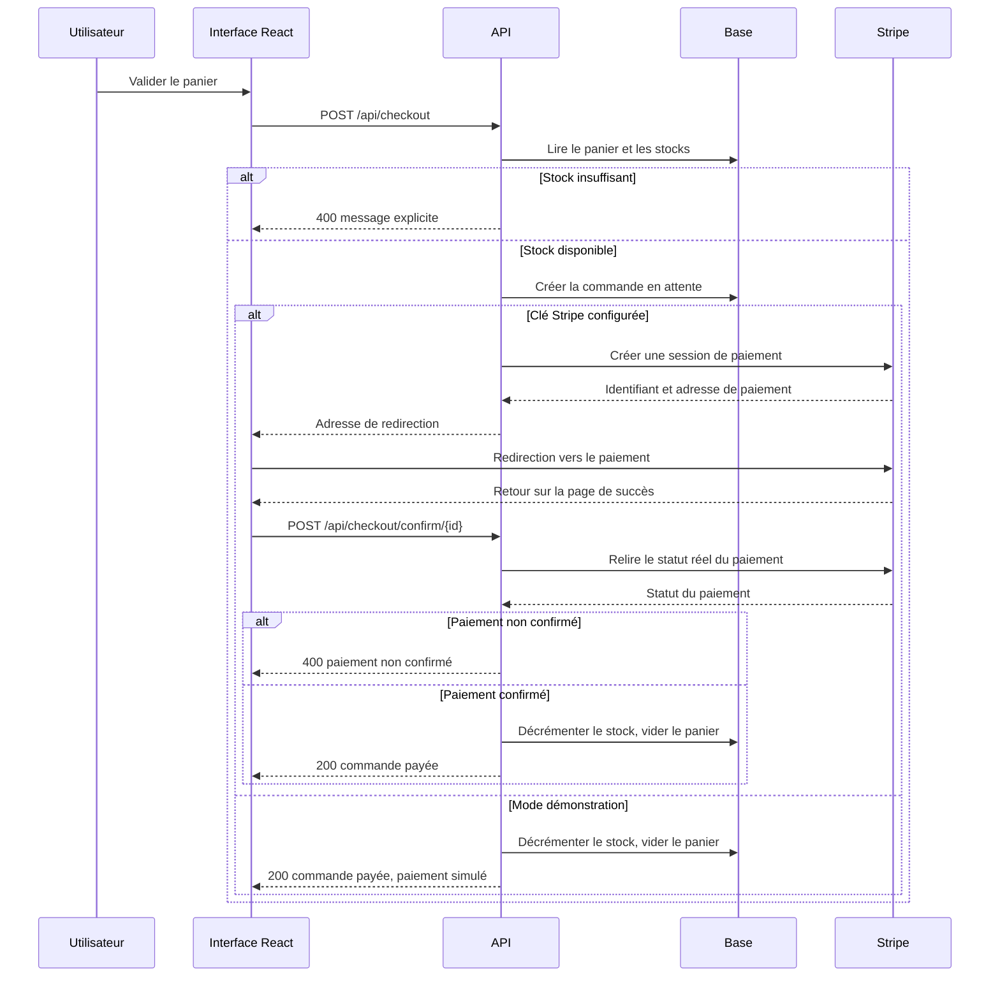
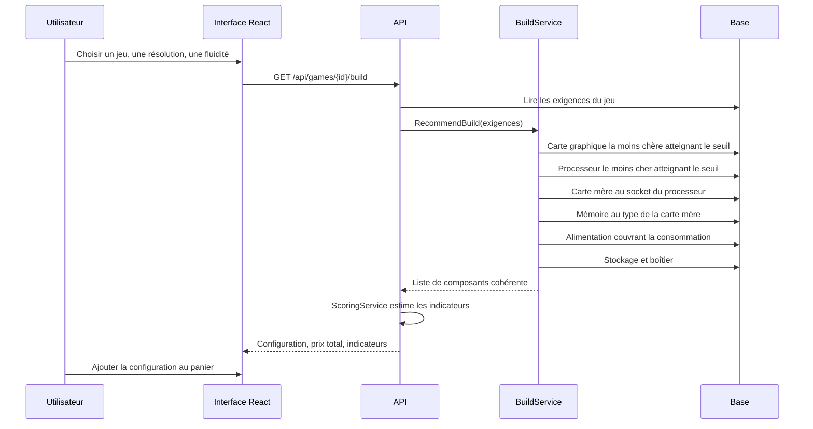
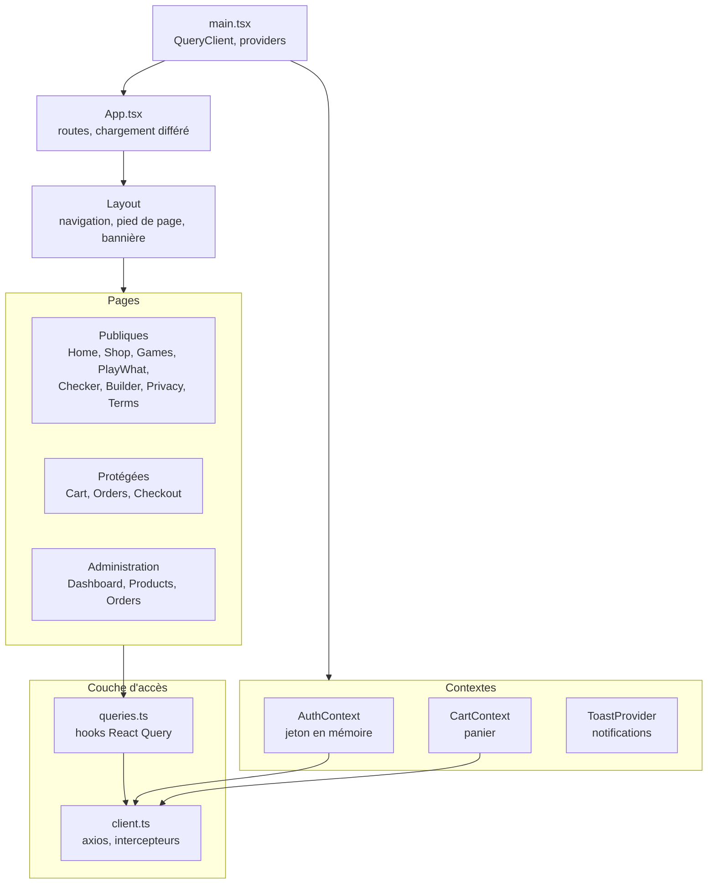

# Dossier de conception

Modélisation de l'application et justification de l'architecture logicielle retenue.
Les diagrammes sont écrits en Mermaid et se rendent directement dans GitHub.

---

## 1. Architecture générale

L'application suit une séparation client serveur stricte. L'interface est une application monopage
sans état serveur, l'interface de programmation est sans session et n'expose que du JSON.



La règle de réécriture est le point clé de ce montage. Elle est appliquée côté serveur, donc le
navigateur croit dialoguer avec une seule origine. Aucune requête entre origines n'a lieu, la
politique de partage des ressources reste verrouillée sur l'origine de développement, et aucun
en-tête supplémentaire n'est nécessaire.

Les liens en pointillés marquent les dépendances non bloquantes. Si FreeToGame, Stripe ou GoatCounter
sont injoignables, l'application continue de fonctionner avec un repli.

---

## 2. Découpage en couches de l'interface de programmation



Trois règles structurent ce découpage.

**Aucune entité de persistance n'est exposée.** Les contrôleurs renvoient des objets de transfert
définis dans `api/DTOs/`. Un changement de schéma n'impose donc pas de changement de contrat.

**Le calcul est isolé de l'accès aux données.** `ScoringService` ne connaît ni le contexte de base ni
les contrôleurs. Il prend des entiers et un objet d'exigences, il rend un résultat. C'est ce qui le
rend testable unitairement sans base, et c'est la classe la mieux couverte du projet.

**L'injection de dépendances est systématique.** Les services sont enregistrés dans `Program.cs` avec
une durée de vie liée à la requête, ce qui permet leur substitution dans les tests d'intégration.

---

## 3. Modèle des classes métier



`JwtKeyProvider` mérite une justification. La clé de signature était auparavant dupliquée entre
l'émission et la validation du jeton. Toute divergence entre les deux valeurs cassait
silencieusement l'authentification. La classe centralise la résolution et fait échouer le démarrage
en production si la clé est absente, plutôt que de signer avec une valeur présente dans le code source.

---

## 4. Le moteur d'estimation

Le calcul répond à une idée simple : dans une configuration, la pièce la plus faible impose sa limite.

```
facteurResolution   = 1,0 en 1080p, 0,7 en 1440p, 0,45 en 4K

limiteGraphique     = scoreGpu / scoreGpuRecommande × fpsVise × facteurResolution
limiteProcesseur    = scoreCpu / scoreCpuRecommande × fpsVise

fpsEstime           = min(limiteGraphique, limiteProcesseur)

ecart               = |scoreGpu − scoreCpu|
penalite            = 0 si ecart <= 25, sinon (ecart − 25) × 0,6

performanceGlobale  = borne(scoreGpu × 0,7 + scoreCpu × 0,3 − penalite, 0, 100)
```

Le seuil de vingt-cinq points et le coefficient de 0,6 sont des constantes assumées, choisies pour
que la pénalité reste perceptible sans écraser le résultat. Elles sont exposées comme constantes
publiques et couvertes par les tests unitaires.

La qualité visuelle atteignable se déduit de la marge par rapport au score recommandé : Ultra à
partir de 115 %, Élevé à partir de 85 %, Moyen en dessous.

---

## 5. Parcours de commande



Deux protections méritent d'être soulignées.

Le stock est relu **à la confirmation**, pas seulement à la création. Entre les deux étapes, un autre
acheteur a pu vider le stock. La colonne concernée porte un jeton de concurrence : deux écritures
simultanées ne peuvent pas s'écraser, la seconde lève une exception traitée comme un conflit.

En mode Stripe réel, le serveur **ne fait jamais confiance au retour du client**. La page de succès
déclenche une relecture du statut auprès de Stripe avant toute décrémentation. Un utilisateur ne peut
pas se déclarer payé en appelant directement l'adresse de confirmation.

---

## 6. Parcours de recommandation



La contrainte de cohérence est ce qui distingue cette fonction d'un simple tri par prix. Une
configuration proposée doit être physiquement assemblable : le socket de la carte mère correspond à
celui du processeur, le type de mémoire correspond à celui de la carte mère, la puissance de
l'alimentation couvre la consommation de la carte graphique. Les caractéristiques nécessaires sont
lues dans le champ de spécifications au format JSON de chaque produit.

Une stratégie de repli en cascade évite l'échec : si aucun composant ne satisfait à la fois le seuil
de performance et la contrainte de compatibilité, le service relâche d'abord le seuil, puis la
contrainte, plutôt que de ne rien proposer.

---

## 7. Organisation de l'interface



Le jeton d'authentification est conservé en **`sessionStorage`**, donc effacé à la fermeture de
l'onglet, et injecté par un intercepteur sur chaque requête sortante. Le choix de
`sessionStorage` plutôt que `localStorage` limite la durée d'exposition ; le jeton expire de
toute façon au bout de douze heures côté serveur. Un second intercepteur surveille les réponses : un état 401 sur une requête qui
portait un jeton déclenche la purge de la session. La distinction est volontaire, un 401 sur une
requête sans jeton est un simple échec de connexion et ne doit pas purger quoi que ce soit.

Chaque page est chargée à la demande, ce qui produit un fragment par page au build et allège le
paquet initial.

---

## 8. Décisions d'architecture et leurs conséquences

| Décision | Motif | Conséquence assumée |
|---|---|---|
| SQLite plutôt qu'un serveur de base | Aucune administration, aucun coût, fonctionne sur l'environnement de développement Linux | Base éphémère en production, régénérée et réalimentée à chaque déploiement |
| Montants stockés en centimes entiers | SQLite ne gère pas nativement le type décimal, et un stockage textuel casserait le tri numérique | Conversion explicite à l'entrée et à la sortie |
| Jeton de concurrence sur le stock | Empêcher la survente sans verrou explicite | Le conflit doit être traité dans les contrôleurs |
| Jeton en `sessionStorage` plutôt qu'en `localStorage` | Réduire la durée d'exposition : la session tombe à la fermeture de l'onglet | Reconnexion nécessaire à chaque nouvel onglet |
| Import des jeux en tâche de fond | Un appel réseau au démarrage bloquait le service une vingtaine de secondes | Les jeux apparaissent quelques secondes après le premier démarrage |
| Adresse de base relative côté interface | L'infrastructure décide du routage, pas le code | Une règle de réécriture est obligatoire à chaque déploiement |
| Documentation d'API réservée au développement | Ne pas exposer la surface de l'interface en production | Elle n'est pas démontrable sur l'adresse publique |
