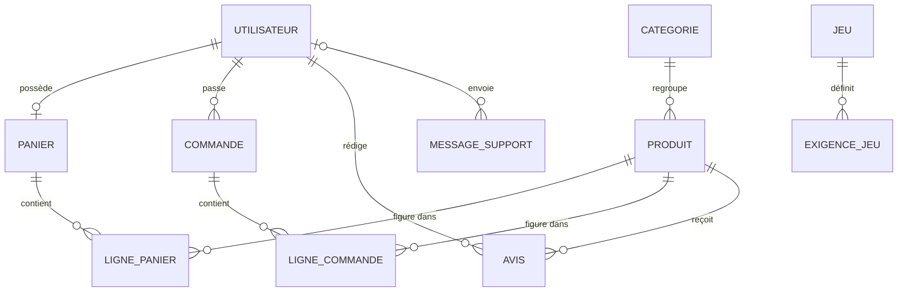

# Modèle de données

Conception de la base et de la couche de persistance. Le modèle est construit avec Entity Framework
Core selon l'approche par le code, les tables étant générées à partir des classes du dossier
`api/Models/` et versionnées par migrations.

---

## 1. Modèle conceptuel

Neuf entités métier, auxquelles s'ajoutent les tables d'authentification fournies par ASP.NET Core
Identity.



### Cardinalités et justifications

| Association | Cardinalité | Justification |
|---|---|---|
| Utilisateur, Panier | 1 à 0 ou 1 | Un panier unique par compte, créé à la première utilisation |
| Utilisateur, Commande | 1 à plusieurs | Historique conservé tant que le compte existe |
| Utilisateur, Message de support | 0 ou 1 à plusieurs | Un visiteur non connecté peut écrire, la clé est donc facultative |
| Catégorie, Produit | 1 à plusieurs | Un composant appartient à une seule catégorie |
| Panier, Ligne de panier | 1 à plusieurs | Association porteuse d'une quantité |
| Commande, Ligne de commande | 1 à plusieurs | Association porteuse d'un prix unitaire figé et d'une quantité |
| Jeu, Exigence | 1 à plusieurs | Une exigence par combinaison de résolution et de fluidité visée |

### Deux points de conception à souligner

**La ligne de commande fige son prix unitaire.** Elle ne renvoie pas au prix courant du produit. Si le
catalogue change, une commande passée conserve le montant réellement facturé. Sans cette
dénormalisation volontaire, l'historique se réécrirait à chaque modification de tarif.

**L'exigence de jeu est une entité, pas un attribut.** Un même jeu porte plusieurs jeux de seuils,
selon la résolution et la fluidité visée. Une table dédiée évite de multiplier les colonnes et permet
d'ajouter une résolution sans migration de schéma.

---

## 2. Modèle logique

```
CATEGORIES     (Id, Name, Slug*)
PRODUCTS       (Id, Name, Brand, Price, Stock, ImageUrl, Description, PerfScore, Specs, #CategoryId)
CARTS          (Id, #UserId)
CARTITEMS      (Id, #CartId, #ProductId, Quantity)
ORDERS         (Id, #UserId, TotalPrice, Status, CreatedAt, StripeSessionId)
ORDERITEMS     (Id, #OrderId, #ProductId, UnitPrice, Quantity)
GAMES          (Id, Title, ImageUrl, ReleaseYear, Genre, Metacritic)
GAMEREQUIREMENTS (Id, #GameId, Resolution, TargetFps, MinGpuScore, RecoGpuScore,
                  MinCpuScore, RecoCpuScore, MinRamGb)
REVIEWS        (Id, #ProductId, #UserId, Rating, Comment, CreatedAt)
SUPPORTMESSAGES (Id, #UserId, Email, Subject, Message, Status, CreatedAt)

ASPNETUSERS    (Id, Email, NormalizedEmail*, PasswordHash, AccessFailedCount,
                LockoutEnd, LockoutEnabled, CreatedAt, ...)
ASPNETROLES    (Id, Name, NormalizedName*)
ASPNETUSERROLES (#UserId, #RoleId)
```

`*` index unique, `#` clé étrangère.

---

## 3. Dictionnaire des données

### PRODUCTS

| Colonne | Type | Contraintes | Rôle |
|---|---|---|---|
| Id | INTEGER | Clé primaire, auto-incrémentée | Identifiant |
| Name | TEXT | Requis | Désignation commerciale réelle |
| Brand | TEXT | Requis | Marque, sert au filtre |
| Price | INTEGER | Requis, stocké en centimes | Prix toutes taxes comprises |
| Stock | INTEGER | Requis, jeton de concurrence | Quantité disponible |
| ImageUrl | TEXT | Facultatif | Photo, repli visuel si absente |
| Description | TEXT | Requis | Texte de la fiche |
| PerfScore | INTEGER | Requis, plage 0 à 100 | Indicateur pilotant le moteur d'estimation |
| Specs | TEXT | Facultatif, JSON | Socket, type de mémoire, consommation, puissance |
| CategoryId | INTEGER | Clé étrangère, suppression restreinte | Catégorie de rattachement |

Le champ de spécifications au format JSON est un choix assumé. Les caractéristiques varient fortement
d'une catégorie à l'autre : un processeur a un socket, une alimentation une puissance, une mémoire un
type. Modéliser chaque caractéristique en colonne aurait produit une table creuse. Le compromis est
l'absence de contrôle de type par la base, compensé par une lecture défensive côté service.

### GAMEREQUIREMENTS

| Colonne | Type | Contraintes | Rôle |
|---|---|---|---|
| Id | INTEGER | Clé primaire | Identifiant |
| GameId | INTEGER | Clé étrangère, suppression en cascade | Jeu concerné |
| Resolution | TEXT | Valeurs 1080p, 1440p, 4K | Résolution visée |
| TargetFps | INTEGER | Valeurs 60 ou 144 | Fluidité visée |
| MinGpuScore | INTEGER | 0 à 100 | Seuil graphique minimal |
| RecoGpuScore | INTEGER | 0 à 100 | Seuil graphique recommandé |
| MinCpuScore | INTEGER | 0 à 100 | Seuil processeur minimal |
| RecoCpuScore | INTEGER | 0 à 100 | Seuil processeur recommandé |
| MinRamGb | INTEGER | En gigaoctets | Mémoire vive minimale |

### ORDERS et ORDERITEMS

| Colonne | Type | Contraintes | Rôle |
|---|---|---|---|
| Orders.TotalPrice | INTEGER | Centimes | Montant total figé |
| Orders.Status | INTEGER | Énumération : 0 en attente, 1 payée, 2 expédiée, 3 annulée | Cycle de vie |
| Orders.CreatedAt | TEXT | Date en temps universel | Horodatage |
| Orders.StripeSessionId | TEXT | Facultatif | Réconciliation avec Stripe |
| OrderItems.UnitPrice | INTEGER | Centimes | Prix au moment de la commande |
| OrderItems.Quantity | INTEGER | Supérieur à zéro | Quantité commandée |

### SUPPORTMESSAGES

| Colonne | Type | Contraintes | Rôle |
|---|---|---|---|
| UserId | TEXT | Facultatif, clé étrangère | Nul si le message vient d'un visiteur |
| Email | TEXT | Requis | Adresse de réponse |
| Status | INTEGER | Énumération : 0 ouvert, 1 répondu | Suivi côté administration |

---

## 4. Contraintes d'intégrité

### Comportements de suppression

| Relation | Comportement | Motif |
|---|---|---|
| Produit vers Catégorie | Restreint | Supprimer une catégorie ne doit pas effacer son catalogue |
| Ligne de commande vers Produit | Restreint | Un historique de vente ne doit jamais disparaître |
| Ligne de panier vers Produit | Cascade | Un produit retiré du catalogue quitte les paniers |
| Exigence vers Jeu | Cascade | Une exigence n'a pas d'existence propre |
| Avis vers Produit | Cascade | Un avis n'a pas de sens sans son produit |

L'opposition entre la ligne de panier, en cascade, et la ligne de commande, restreinte, est
volontaire. Le panier est un état transitoire, la commande est un fait comptable.

### Index

| Index | Table | Motif |
|---|---|---|
| Unique sur Slug | CATEGORIES | Le slug sert d'identifiant dans les adresses et dans le service de composition |
| Unique sur NormalizedEmail | ASPNETUSERS | Unicité de l'adresse, imposée par la configuration Identity |

### Contrôle de concurrence

La colonne de stock porte un jeton de concurrence. Entity Framework Core l'inclut dans la clause de
filtrage de chaque mise à jour. Si la valeur a changé entre la lecture et l'écriture, aucune ligne
n'est affectée et une exception de concurrence est levée. Deux confirmations simultanées sur le même
produit ne peuvent donc pas survendre.

---

## 5. Couche de persistance

### Conversion des montants

SQLite ne dispose pas d'un type décimal natif. Trois options se présentaient : stocker en nombre à
virgule flottante, en texte, ou en entier.

Le flottant introduit une dérive de précision sur les sommes. Le texte casse le tri numérique, où la
chaîne `199.99` se classe avant `9.99`. Le choix retenu est **l'entier en centimes**, avec un
convertisseur de valeur déclaré dans `AppDbContext`. La précision est exacte, le tri est correct, et
la conversion reste invisible depuis le code métier qui continue de manipuler des décimaux.

### Migrations

| Migration | Objet |
|---|---|
| `InitialCreate` | Schéma initial, entités métier et tables Identity |
| `AddGameMetadata` | Genre et note Metacritic sur les jeux |
| `AddStockConcurrencyToken` | Jeton de concurrence sur le stock |
| `StoreMoneyAsCents` | Passage des montants en centimes entiers |

Les migrations sont appliquées automatiquement au démarrage. La base est donc créée et mise à jour
sans intervention, ce qui rend le projet exécutable après un simple clonage.

### Alimentation initiale

Le catalogue de composants provient d'un jeu de données libre, transformé hors ligne vers un fichier
JSON embarqué dans l'assemblage. Il est lu au premier démarrage sur base vide. Ce choix garantit un
fonctionnement hors connexion et des données réelles.

Le catalogue de jeux est importé depuis FreeToGame **en tâche de fond**, après que l'interface de
programmation a commencé à répondre. Un import bloquant au démarrage avait été mesuré à une
vingtaine de secondes, pendant lesquelles le service était indisponible. En cas d'échec, une liste
de seize jeux intégrée au code prend le relais.

Deux comptes de démonstration sont créés, un administrateur et un client, avec des mots de passe
conformes à la politique appliquée aux comptes réels.

### Sauvegarde et restauration

En développement et dans les conteneurs locaux, la base est un fichier unique, sauvegardé par simple
copie et monté sur un volume persistant.

En production sur l'offre gratuite de Render, le système de fichiers est éphémère : la base est
recréée et réalimentée à chaque redéploiement. C'est acceptable pour une démonstration dont les
données sont volatiles par nature, et c'est documenté dans [`../DEPLOY.md`](../DEPLOY.md). Une mise
en service réelle imposerait un volume persistant ou un service de base de données géré.
