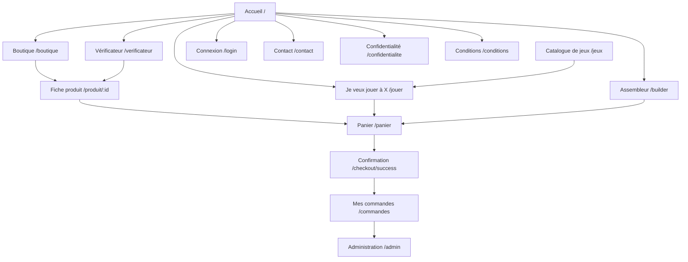

# Maquettes, zoning et interface

Description des écrans, de leur découpage et de la charte appliquée. La planche visuelle
correspondante est référencée en fin de document.

---

## 1. Méthode

L'approche retenue est celle du zoning : découper chaque écran en zones fonctionnelles avant de
décider de leur apparence. Trois principes ont guidé la mise en page.

**Une entrée par intention.** Le site ne propose pas un catalogue unique mais quatre parcours, chacun
répondant à une question différente. La page d'accueil oriente vers l'un d'eux plutôt que d'exposer
tout le catalogue.

**L'information de décision au-dessus de la ligne de flottaison.** Sur une fiche produit, le prix,
la disponibilité et l'indicateur de performance sont visibles sans défiler. Les caractéristiques
détaillées viennent après.

**Une approche mobile d'abord sur les grilles.** Toutes les grilles sont déclarées en ajustement
automatique avec une largeur minimale par élément. Elles passent d'une à quatre colonnes en continu,
sans point de rupture intermédiaire. Un seul point de rupture réel existe, à 860 pixels, où les mises
en page à deux colonnes s'empilent et où le menu bascule en menu déroulant.

---

## 2. Arborescence



Le panier est le point de convergence des trois parcours de recommandation. C'est volontaire : quel
que soit le chemin d'entrée, l'aboutissement est le même geste d'achat.

---

## 3. Gabarit commun

Toutes les pages publiques partagent le même gabarit.

```
┌────────────────────────────────────────────────┐
│ BARRE DE NAVIGATION  (collante, hauteur 64 px) │
│ Logo │ Liens de parcours │ Panier │ Compte     │
├────────────────────────────────────────────────┤
│                                                │
│ CONTENU DE LA PAGE                             │
│ largeur min(1200 px, 92 % de la fenêtre)       │
│                                                │
├────────────────────────────────────────────────┤
│ PIED DE PAGE                                   │
│ Identité │ Liens légaux et parcours            │
├────────────────────────────────────────────────┤
│ BANNIÈRE DE CONSENTEMENT (jusqu'au choix)      │
└────────────────────────────────────────────────┘
```

Sous 860 pixels, les liens de parcours de la barre de navigation se replient derrière un bouton de
menu, et le panneau s'ouvre en position absolue sous la barre.

---

## 4. Zoning écran par écran

### 4.1 Accueil

Deux colonnes qui s'empilent sur mobile. À gauche, la proposition de valeur en une phrase et deux
appels à l'action, le premier en accent d'action, le second en accent de navigation. À droite, un
aperçu animé de configuration avec ses indicateurs, qui montre le produit avant de l'expliquer.

Suit une bande d'indicateurs, puis quatre cartes numérotées présentant les quatre parcours, puis une
sélection de produits les mieux notés.

Le premier écran contient donc à la fois la promesse et le point d'entrée. Aucun défilement n'est
nécessaire pour comprendre ce que fait le site et commencer à l'utiliser.

### 4.2 Boutique

Bandeau de filtres en grille automatique : recherche, catégorie, marque, fourchette de prix,
performance minimale, tri. Sous 860 pixels, ces contrôles passent sur deux colonnes puis une.

Grille de produits en ajustement automatique, largeur minimale de 220 pixels par carte. Chaque carte
a un rapport de forme fixe de trois pour deux sur sa zone d'image, ce qui garantit des cartes de
hauteur identique et supprime tout décalage pendant le chargement.

Pagination en bas, douze produits par page.

### 4.3 Fiche produit

Deux colonnes. À gauche l'image, dans un cadre au rapport de forme fixe. À droite, dans l'ordre de
lecture : étiquettes de marque, catégorie et performance, titre, note moyenne, description, prix en
grand, disponibilité, sélecteur de quantité et bouton d'ajout.

Les caractéristiques détaillées viennent sous cet ensemble, dans un tableau à deux colonnes placé
dans un conteneur à défilement horizontal.

Les avis occupent une section pleine largeur en bas de page, avec le formulaire de publication si
l'utilisateur est connecté.

Sous 860 pixels, une barre d'achat collante apparaît en bas de l'écran, avec le prix et le bouton
d'ajout. Sans elle, le bouton d'achat sortait du champ visible dès le défilement vers les
caractéristiques.

### 4.4 Je veux jouer à X

Deux colonnes. À gauche la sélection : un jeu, une résolution, une fluidité visée. À droite un
panneau collant qui affiche la configuration composée, le prix total, les indicateurs estimés et le
bouton d'ajout au panier.

Le panneau est collant parce que la liste des composants est longue et que le montant total doit
rester visible pendant la lecture.

### 4.5 Vérificateur

Bandeau de sélection en trois champs, processeur, carte graphique, jeu. En dessous, le verdict occupe
toute la largeur, en trois états visuellement distincts : recommandé, minimum, insuffisant.

Quand le verdict est insuffisant, une proposition de mise à niveau ciblée apparaît, avec un lien
direct vers la fiche du composant conseillé. Le parcours se referme donc sur l'achat.

### 4.6 Assembleur

Deux colonnes. À gauche les emplacements de composants, chacun avec sa vignette et son sélecteur. À
droite un panneau collant avec cinq barres d'indicateurs animées, recalculées à chaque changement.

Les incompatibilités sont signalées à l'endroit où elles naissent, avec une explication en langage
courant et un substitut compatible proposé en un clic.

### 4.7 Panier et commande

Liste des lignes avec vignette, désignation, prix unitaire, sélecteur de quantité et retrait.
Récapitulatif dans un panneau collant à droite, avec le total et le bouton de validation.

La page de confirmation reprend le même gabarit centré que la page d'erreur : un symbole, un titre,
un message, un bouton de continuation.

### 4.8 Administration

Gabarit distinct à barre latérale : navigation entre tableau de bord, produits, catégories, commandes
et support. Le tableau de bord présente cinq indicateurs en cartes, puis le classement des produits
vendus. Les listes sont des tableaux placés dans des conteneurs à défilement horizontal.

---

## 5. Charte graphique appliquée

La direction artistique est référencée dans [`../README.md`](../README.md) et implémentée sous forme
de variables dans `client/src/index.css`.

### Couleurs

| Rôle | Valeur | Usage |
|---|---|---|
| Fond | `#0a0e14` | Noir bleuté, jamais noir pur |
| Surface | `#121826` | Cartes et panneaux |
| Surface haute | `#1a2332` | Survol et élévation |
| Bordure | `#223049` | Séparations |
| Accent cyan | `#22d3ee` | Liens actifs, barres, structure |
| Accent jaune | `#f5d90a` | Actions d'achat exclusivement |
| Danger | `#ff2a6d` | Erreurs, verdict insuffisant |
| Succès | `#34f5c5` | Barre pleine, verdict favorable |
| Texte | `#e2e8f0` | Gris clair, jamais de cyan sur du texte courant |
| Texte atténué | `#8a93a3` | Informations secondaires |

La règle qui structure l'ensemble tient en une phrase : **le cyan guide, le jaune fait agir**. Le
jaune n'apparaît que sur les boutons qui déclenchent un achat. Cette contrainte donne au regard une
information avant même la lecture.

### Typographie

| Famille | Rôle | Motif |
|---|---|---|
| Chakra Petch | Titres | Géométrique et légèrement technique, en accord avec le sujet |
| JetBrains Mono | Chiffres, prix, indicateurs | Chasse fixe, les colonnes de chiffres s'alignent |
| Space Grotesk | Texte courant | Lisible en petit corps, cohérente avec les deux autres |

### Motifs récurrents

Rayon de bordure unique de 10 pixels. Transitions de 220 millisecondes, désactivées si l'utilisateur
a exprimé une préférence de mouvement réduit. Maillage de fond très discret, à 3,5 % d'opacité, qui
donne la texture sans fatiguer la lecture.

---

## 6. Planche de wireframes

**https://claude.ai/code/artifact/e564f6bf-97ec-497d-86eb-ea03de1b878e**

Onze cadres sur une seule planche pan et zoom : les huit écrans en version bureau à 1120 pixels,
puis l'accueil, la boutique et la fiche produit en version mobile à 375 pixels.

Chaque cadre porte ses zones fonctionnelles annotées par une pastille numérotée, et une légende qui
explique chacune d'elles. Les conventions graphiques sont rappelées sur la planche : cadre pointillé
pour une zone annotée, aplat gris pour un bloc de contenu, barre grise pour une ligne de texte de
substitution, aplat foncé pour une action principale, trait rouge pour la ligne de flottaison.

La planche s'exporte en image ou en document imprimable pour intégration au mémoire professionnel.
